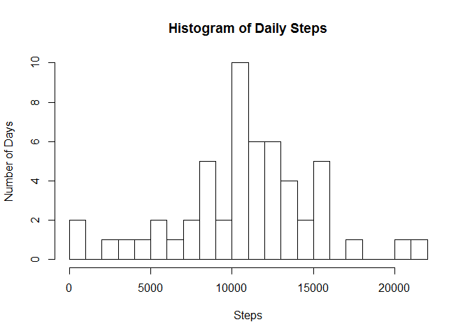
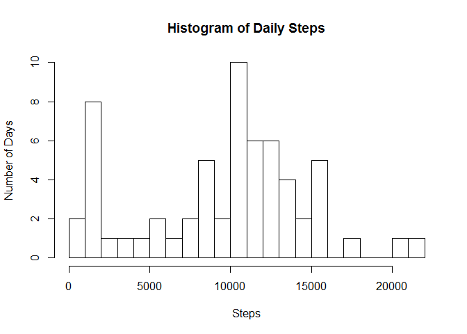

# Reproducible Research: Peer Assessment 1

## Introduction

This analysis makes use of data from a personal activity monitoring device. Further information on this dataset can be found in the README.md file.

## Loading and preprocessing the data
Load libraries that will be used for this analysis


```r
require(plyr)
require(dplyr)
require(lattice)
```


Read the cvs data file, after unziping it,  and create two additional aggregate data set for later use.

```r
activity <- read.csv("activity.csv")
daily <- aggregate(steps ~ date, sum, data=activity)
periods <- aggregate(steps ~ interval, mean, data=activity)
```


## What is mean total number of steps taken per day?
The following is a histogram of the total number of steps taken each day.


```r
hist(daily$steps, breaks = 16, main = "Histogram of Daily Steps",
     xlab = "Steps", ylab = "Number of Days")
```

\

The **mean** and **median** of the total number of steps taken per day are:


```r
mean(daily$steps)
```

```
## [1] 10766.19
```

```r
median(daily$steps)
```

```
## [1] 10765
```

## What is the average daily activity pattern?

The plot below shows the average steps per 5 minute period for the entire two month period.  NA values in the data are ignored. Note that the intervals are coded as HHMM
(1500 is 3 PM,   915 is 9:15 AM).


```r
plot(periods,type = "l")
```

\

The maximum average number of steps for any period is: 

```r
max(periods$steps)
```

```
## [1] 206.1698
```

which occurs during the time period:

```r
periods[which.max( periods[,2] ),1]
```

```
## [1] 835
```

## Imputing missing values

The total number of rows where "steps" has NA instead of actual measurements
obtained from the following: 

```r
colSums(is.na(activity)) 
```

```
##    steps     date interval 
##     2304        0        0
```

Impute the missing values by replacing each NA with the median of non NA
values for the corresponding interval time.


```r
## build a data set with a column for the median of the interval
activityI <- activity %>% 
  group_by(interval) %>% 
  mutate(median = median(steps,na.rm = TRUE))
## Find the NA values and replace them with the median for the interval
for (i in 1:nrow(activityI))
  {
  if (is.na(activityI[i,"steps"])) 
    activityI[i,"steps"] = activityI[i,"median"]
  }
## Reduce back to mirror initial dataset with NA replaced by median.
activityI <- activityI[,1:3] 
```


```r
## sum the steps for each day and them create histogram
aggregate(steps ~ date, sum, data=activityI)[,2] %>%
       hist(breaks = 16, main = "Histogram of Daily Steps",
          xlab = "Steps", ylab = "Number of Days")
```

\

The **mean** and **median** of the total number of steps taken per day with the imputed data added are:


```r
## sum the steps for each day and compute stats
mean(aggregate(steps ~ date, sum, data=activityI)[,2]) 
```

```
## [1] 9503.869
```

```r
median(aggregate(steps ~ date, sum, data=activityI)[,2])
```

```
## [1] 10395
```

This approach does not look like it added any value.  The histogram including
the imputed values is just more scewed to lower steps per day.  The mean and
median of the daily steps are also lower that the original data.
If there is anything to be gained by imputing values, a more sophisticated
approach will be needed.

## Are there differences in activity patterns between weekdays and weekends?

We will look at the data divided up by weekend day (Saturday and Sunday) vs. the weekdays.  First we need to create a factor to separate the two categories.
The we can plot the time series for each as well as look at the means to see what
the differences are.


```r
## Determine the weekdays for each date
## then set the day that are weekends,
##  then set a logical true if a weekend, false otherwise
weekend <- c("Saturday", "Sunday")
activity$dayType <- weekdays((as.Date(activity$date)))
activity$dayType <- activity$dayType %in% weekend
## Set the true/false as "weekend"" and "weekday""
## then aggregate the mean of the steps by interval and dayType
# and plot it
activity$dayType <- factor(activity$dayType,
     levels=c(FALSE, TRUE), labels=c('weekday', 'weekend'))
periodsF <- aggregate(steps ~ interval + dayType, mean, data=activity)
ddply(activity, .(dayType), summarize, mean=mean(steps, na.rm=TRUE))
```

```
##   dayType     mean
## 1 weekday 35.33796
## 2 weekend 43.07837
```

```r
xyplot(steps~interval|dayType, data=periodsF, type="l", layout = c(1, 2))
```

\

The means show a increase number of steps on weekends.  
The plot indicates a higher level of activity in the late morning 
through the afternoon for the weekend.

The only time the weekdays are consistantly higher appears to be in the morning
hours between 5 and 9ish.


